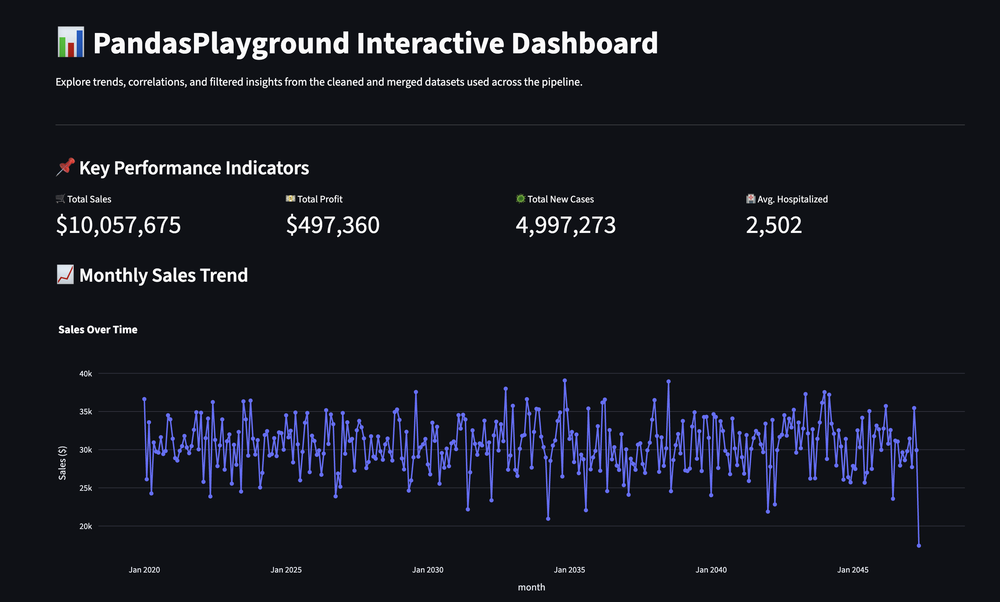

# 📊 PandasPlayground – A Comprehensive Data Manipulation Project


> Master data manipulation with **pandas** — from fundamentals to advanced performance tuning — using real-world datasets and modular notebooks.

---

## 🧠 Project Purpose

**PandasPlayground** is designed to help aspiring data scientists and analysts master the entire pandas ecosystem through hands-on, progressive, and fully-documented Jupyter notebooks. Each module targets a specific capability — from data loading and cleaning to advanced transformations and memory profiling — ensuring a complete learning and review reference.



> 🔍 Preview: Explore datasets, visualize trends, and profile performance — all in one playground!

---

## 📁 Project Structure

```plaintext
PandasPlayground/
├── assets/               # Charts, exports, and visual output images
├── cheatsheets/          # Markdown-based reference sheets (e.g., pandas_cheatsheet.md)
├── data/                 # Raw datasets (CSV, Excel, JSON, Parquet)
├── exports/              # Final output files (CSV, Excel, styled reports)
├── notebooks/            # All 10 learning notebooks (01–10)
├── pages/                # Streamlit multipage app (expanded)
├── pandas_env/           # Local virtual environment (⚠️ add to .gitignore)
├── scripts/              # Modular reusable utility functions
├── Dockerfile            # Docker support for reproducible environments
├── LICENSE.md
├── README.md             # You’re here!
├── requirements.txt      # All required dependencies
└── STREAMLIT_App.py      # Interactive dashboard using Streamlit
```

---

## 🧾 Datasets Used

This project uses **artificially generated datasets** designed to replicate common real-world scenarios. Each file highlights a unique aspect of data handling and analysis using `pandas`.

| Dataset File                 | Format  | Purpose                                                    |
| ---------------------------- | ------- | ---------------------------------------------------------- |
| `superstore_sales.csv`       | CSV     | Simulated retail sales data for grouping, time series      |
| `weather_data.json`          | JSON    | Unstructured data for parsing, cleaning, and visualization |
| `bank_loans.xlsx`            | Excel   | Tabular data for filtering, EDA, and feature engineering   |
| `bank_loans_multisheet.xlsx` | Excel   | Multi-sheet structure for advanced Excel parsing           |
| `covid_data.parquet`         | Parquet | Efficient columnar data for joins and time-based analysis  |

> 🛠 These datasets are **not from public sources** and were created to demonstrate the versatility of `pandas` across different formats and data challenges. You can find them in the [`data/`](./data/) folder.

---

## ✅ Modules and Concepts

| Notebook                             | Concepts                                           |
| ------------------------------------ | -------------------------------------------------- |
| `01_data_loading.ipynb`              | Load data, inspect structure, parse dates          |
| `02_data_cleaning.ipynb`             | Handle missing values, type conversion, string ops |
| `03_aggregation_grouping.ipynb`      | GroupBy, pivot, window functions                   |
| `04_merging_joining.ipynb`           | Merge, concat, index joins                         |
| `05_time_series.ipynb`               | Resample, rolling, timezone handling               |
| `06_advanced_pandas.ipynb`           | .apply(), .map(), method chaining, memory tuning   |
| `07_visualization_with_pandas.ipynb` | Bar, line, box, grouped plots                      |
| `08_final_pipeline.ipynb`            | End-to-end data workflow pipeline                  |
| `09_reporting_exporting.ipynb`       | Export to Excel/CSV/Parquet, styled reports        |
| `10_performance_diagnostics.ipynb`   | Profiling, eval(), categorical, Dask               |

---

## 📚 Learning Outcomes

✅ Develop fluency with `pandas` core APIs
✅ Build modular, reusable data pipelines
✅ Understand performance bottlenecks in large datasets
✅ Practice version-controlled and containerized data science

---

## 📦 Installation

```bash
# Create virtual environment
python -m venv venv
source venv/bin/activate  # On Windows: venv\Scripts\activate

# Install dependencies
pip install -r requirements.txt
```

---

### 🐳 Run with Docker (Optional)

```bash
# Build image
docker build -t pandasplayground .

# Run container on http://localhost:8899
docker run -pd 8899:8888 -v $(pwd):/app pandasplayground
```

---

## 💻 Using the Project

- 🔄 Want to use this on your own data? Start with `08_final_pipeline.ipynb`
- 🧩 Reuse functions from `scripts/` for your own ETL workflows
- 🐳 Use `Dockerfile` to run in an isolated, reproducible environment

---

## 🧰 Tools & Libraries

- **pandas**
- **numpy**
- **matplotlib**, **seaborn**
- **Jupyter**, **JupyterLab**
- **openpyxl**, **pyarrow**
- **memory_profiler**, **psutil**
- **Streamlit** (for interactive dashboards)

---

## 🔗 Related Projects

- 🧮 [NumPyMasterPro](https://github.com/SatvikPraveen/NumPyMasterPro) – Master NumPy with modular walkthroughs

---

Absolutely! Here's an expanded and professional version of the **How to Contribute or Fork** section to better guide future collaborators:

---

## 🤝 How to Contribute or Fork

Whether you're fixing a bug, suggesting an enhancement, or adding new learning notebooks — contributions are welcome and appreciated!

### 🔀 Fork & Clone the Repository

```bash
# Step 1: Fork this repository on GitHub
# Step 2: Clone your fork locally
git clone https://github.com/your-username/PandasPlayground.git
cd PandasPlayground
```

### 🌱 Create a Feature Branch

Always create a new branch for your changes instead of working on `main`:

```bash
git checkout -b feature/your-feature-name
```

### 🛠 Make Your Changes

- Add your improvements (e.g., a new notebook, function in `scripts/`, or fixes in `requirements.txt`)
- Follow consistent formatting, naming, and markdown style as used across the project
- Update the README.md or cheatsheets if your change impacts the documentation
- Test your code locally (if it includes logic)

### ✅ Commit and Push

```bash
git add .
git commit -m "✨ Added: Short summary of your feature"
git push origin feature/your-feature-name
```

### 📩 Submit a Pull Request

- Go to your fork on GitHub
- Click **"Compare & pull request"**
- Provide a clear and concise description of your changes
- If applicable, reference any related issue (e.g., `Fixes #12`)
- Wait for review or feedback

---

### 🧪 Contribution Tips

- Keep changes **modular and atomic** — one feature or fix per pull request
- Be sure to **sync your fork** with the upstream repository periodically:

  ```bash
  git remote add upstream https://github.com/SatvikPraveen/PandasPlayground.git
  git pull upstream main
  ```

- If your feature involves code, prefer writing **reusable functions** in `scripts/` and importing them in your notebooks

---

### 🙏 Thank You

Every contribution, no matter how small, helps improve this resource for the entire data science community.
Let’s build this playground together! 🎉

---

## 📜 License

This project is licensed under the MIT License. See [LICENSE](./LICENSE) for more info.

---

## 🙋‍♂️ Author

Built with 💻 and ☕ by [Satvik Praveen](https://github.com/SatvikPraveen)
Drop a ⭐ if you find this project helpful!
