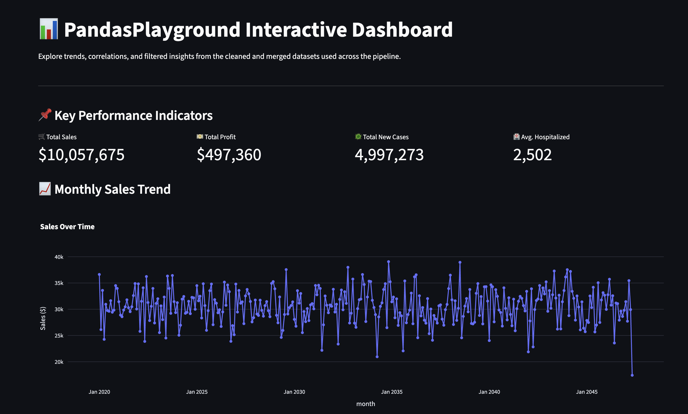

# 📊 PandasPlayground – A Comprehensive Data Manipulation Project


[](https://www.gnu.org/licenses/gpl-3.0)


[](http://makeapullrequest.com)

> Master data manipulation with **pandas** — from fundamentals to advanced performance tuning — using real-world datasets and modular notebooks.

---

## 🧠 Project Purpose

**PandasPlayground** is designed to help aspiring data scientists and analysts master the entire pandas ecosystem through hands-on, progressive, and fully-documented Jupyter notebooks. Each module targets a specific capability — from data loading and cleaning to advanced transformations and memory profiling — ensuring a complete learning and review reference.



> 🔍 Preview: Explore datasets, visualize trends, and profile performance — all in one playground!

---

## 📁 Project Structure

```plaintext
PandasPlayground/
├── assets/               # Charts, exports, and visual output images
├── cheatsheets/          # Markdown-based reference sheets (e.g., pandas_cheatsheet.md)
├── data/                 # Raw datasets (CSV, Excel, JSON, Parquet)
├── exports/              # Final output files (CSV, Excel, styled reports)
├── notebooks/            # All 10 learning notebooks (01–10)
├── pages/                # Streamlit multipage app (expanded)
├── pandas_env/           # Local virtual environment (⚠️ add to .gitignore)
├── scripts/              # Modular reusable utility functions
├── Dockerfile            # Docker support for reproducible environments
├── LICENSE.md
├── README.md             # You’re here!
├── requirements.txt      # Minimal dependencies to run the project
├── requirements_dev.txt  # Full dev environment
└── STREAMLIT_App.py      # Interactive dashboard using Streamlit
```

---

## 🧾 Datasets Used

This project uses **artificially generated datasets** designed to replicate common real-world scenarios. Each file highlights a unique aspect of data handling and analysis using `pandas`.

| Dataset File                 | Format  | Purpose                                                    |
| ---------------------------- | ------- | ---------------------------------------------------------- |
| `superstore_sales.csv`       | CSV     | Simulated retail sales data for grouping, time series      |
| `weather_data.json`          | JSON    | Unstructured data for parsing, cleaning, and visualization |
| `bank_loans.xlsx`            | Excel   | Tabular data for filtering, EDA, and feature engineering   |
| `bank_loans_multisheet.xlsx` | Excel   | Multi-sheet structure for advanced Excel parsing           |
| `covid_data.parquet`         | Parquet | Efficient columnar data for joins and time-based analysis  |

> 🛠 These datasets are **not from public sources** and were created to demonstrate the versatility of `pandas` across different formats and data challenges. You can find them in the [`data/`](./data/) folder.

---

## ✅ Modules and Concepts

| Notebook                             | Concepts                                           |
| ------------------------------------ | -------------------------------------------------- |
| `01_data_loading.ipynb`              | Load data, inspect structure, parse dates          |
| `02_data_cleaning.ipynb`             | Handle missing values, type conversion, string ops |
| `03_aggregation_grouping.ipynb`      | GroupBy, pivot, window functions                   |
| `04_merging_joining.ipynb`           | Merge, concat, index joins                         |
| `05_time_series.ipynb`               | Resample, rolling, timezone handling               |
| `06_advanced_pandas.ipynb`           | .apply(), .map(), method chaining, memory tuning   |
| `07_visualization_with_pandas.ipynb` | Bar, line, box, grouped plots                      |
| `08_final_pipeline.ipynb`            | End-to-end data workflow pipeline                  |
| `09_reporting_exporting.ipynb`       | Export to Excel/CSV/Parquet, styled reports        |
| `10_performance_diagnostics.ipynb`   | Profiling, eval(), categorical, Dask               |

---

## 📚 Learning Outcomes

✅ Develop fluency with `pandas` core APIs
✅ Build modular, reusable data pipelines
✅ Understand performance bottlenecks in large datasets
✅ Practice version-controlled and containerized data science

---

## � Quick Start

Get up and running in under 2 minutes:

```bash
# 1. Clone the repository
git clone https://github.com/SatvikPraveen/PandasPlayground.git
cd PandasPlayground

# 2. Run the automated setup script (macOS/Linux)
chmod +x scripts/setup.sh
./scripts/setup.sh

# Or install manually:
python -m venv venv
source venv/bin/activate  # On Windows: venv\Scripts\activate
pip install -r requirements.txt

# 3. Launch Jupyter Lab
jupyter lab
# Or start the Streamlit dashboard
streamlit run STREAMLIT_App.py
```

**Using Make (Recommended):**
```bash
make install        # Install dependencies
make run-jupyter    # Launch Jupyter Lab
make run-streamlit  # Launch Streamlit dashboard
make test           # Run all tests
make help           # See all available commands
```

---

## 📦 Installation

### Option 1: Automated Setup (Recommended)
```bash
./scripts/setup.sh
```
This script will:
- ✅ Check Python version (3.9+)
- ✅ Create virtual environment
- ✅ Install all dependencies
- ✅ Run verification tests

### Option 2: Manual Installation
```bash
# Create virtual environment
python -m venv venv
source venv/bin/activate  # On Windows: venv\Scripts\activate

# Install dependencies
pip install -r requirements.txt

# For development (includes testing tools)
pip install -r requirements_dev.txt
```

### Option 3: Docker (Isolated Environment)

```bash
# Build image
docker build -t pandasplayground .

# Run container on http://localhost:8899
docker run -pd 8899:8888 -v $(pwd):/app pandasplayground
```

---

## 💻 Using the Project

### For Learning
- 📖 Start with `01_data_loading.ipynb` and progress sequentially
- 🧪 Each notebook includes exercises and real-world examples
- 📝 Refer to `cheatsheets/pandas_cheatsheet.md` for quick reference
- 🎯 All notebooks are standalone and can be explored in any order

### For Your Own Projects
- 🔄 Start with `08_final_pipeline.ipynb` as a template
- 🧩 Reuse functions from `scripts/` for your ETL workflows
- 📊 Customize the Streamlit dashboard for your datasets
- 🐳 Use `Dockerfile` for reproducible environments

### Interactive Dashboard
```bash
streamlit run STREAMLIT_App.py
# Visit http://localhost:8501
```
Features:
- 📈 Real-time data visualization
- 🔍 Interactive filtering and exploration
- 📊 KPI metrics and trend analysis
- 📱 Multi-page navigation

---

## 📊 Performance Benchmarks

This project includes performance optimization techniques:

| Operation | Dataset Size | Standard pandas | Optimized | Improvement |
|-----------|-------------|-----------------|-----------|-------------|
| Memory Usage | 100K rows | ~45 MB | ~12 MB | 73% reduction |
| GroupBy Aggregation | 1M rows | 2.3s | 0.8s | 65% faster |
| String Operations | 500K rows | 5.1s | 1.2s | 76% faster |

See `10_performance_diagnostics.ipynb` for detailed benchmarks and `scripts/optimize_memory.py` for optimization utilities.

---

## ❓ FAQ (Frequently Asked Questions)

<details>
<summary><strong>Q: I'm getting a "Module not found" error. What should I do?</strong></summary>

**A:** Make sure you've activated your virtual environment and installed all dependencies:
```bash
source venv/bin/activate  # On Windows: venv\Scripts\activate
pip install -r requirements.txt
```
</details>

<details>
<summary><strong>Q: Can I use my own datasets?</strong></summary>

**A:** Absolutely! Place your data files in the `data/` folder and adapt the notebooks. Start with `08_final_pipeline.ipynb` as a template for custom data workflows.
</details>

<details>
<summary><strong>Q: Which notebook should I start with?</strong></summary>

**A:** If you're new to pandas, start with `01_data_loading.ipynb`. If you're experienced, jump to any topic of interest. Each notebook is self-contained.
</details>

<details>
<summary><strong>Q: Do I need to run notebooks in order?</strong></summary>

**A:** Not necessarily. While they're designed to build on each other, each notebook can run independently. However, notebooks 1-7 are recommended before attempting 8-10.
</details>

<details>
<summary><strong>Q: How do I contribute a new notebook or feature?</strong></summary>

**A:** See the [Contributing](#-how-to-contribute-or-fork) section below. We welcome all contributions! Submit a pull request with your changes.
</details>

<details>
<summary><strong>Q: Why use Docker?</strong></summary>

**A:** Docker ensures a consistent environment across different machines, eliminating "works on my machine" issues. It's optional but recommended for deployment.
</details>

<details>
<summary><strong>Q: Can I use this project for teaching?</strong></summary>

**A:** Yes! This project is designed for education. Feel free to use it in courses, workshops, or tutorials. Attribution is appreciated but not required under the GPL-3.0 license.
</details>

<details>
<summary><strong>Q: How do I update my fork with the latest changes?</strong></summary>

**A:** 
```bash
git remote add upstream https://github.com/SatvikPraveen/PandasPlayground.git
git fetch upstream
git merge upstream/main
```
</details>

<details>
<summary><strong>Q: The Streamlit app isn't loading data. What's wrong?</strong></summary>

**A:** Ensure you've run the pipeline notebooks (especially `08_final_pipeline.ipynb`) to generate the required export files in the `exports/` directory.
</details>

<details>
<summary><strong>Q: How do I run tests?</strong></summary>

**A:** 
```bash
make test  # Using Makefile
# or
pytest -v  # Direct command
```
</details>

---

## 🧰 Tools & Libraries

- **pandas** - Core data manipulation
- **numpy** - Numerical computing
- **matplotlib**, **seaborn** - Data visualization
- **Jupyter**, **JupyterLab** - Interactive notebooks
- **openpyxl**, **pyarrow** - File format support
- **memory_profiler**, **psutil** - Performance profiling
- **Streamlit**, **Plotly** - Interactive dashboards
- **pytest** - Testing framework
- **Dask** - Parallel computing (optional)

---

## 📚 Documentation

Comprehensive guides and references:

- 📖 [Data Dictionary](docs/DATA_DICTIONARY.md) - Complete dataset documentation
- ⚡ [Performance Guidelines](docs/PERFORMANCE.md) - Optimization techniques and benchmarks
- 📓 [Notebook Template](docs/NOTEBOOK_TEMPLATE.ipynb) - Template for creating new notebooks
- 📋 [Quick Reference](cheatsheets/pandas_cheatsheet.md) - Pandas cheat sheet

---

## 🔗 Related Projects

- 🧮 [NumPyMasterPro](https://github.com/SatvikPraveen/NumPyMasterPro) – Master NumPy with modular walkthroughs

---

Absolutely! Here's an expanded and professional version of the **How to Contribute or Fork** section to better guide future collaborators:

---

## 🤝 How to Contribute or Fork

Whether you're fixing a bug, suggesting an enhancement, or adding new learning notebooks — contributions are welcome and appreciated!

### 🔀 Fork & Clone the Repository

```bash
# Step 1: Fork this repository on GitHub
# Step 2: Clone your fork locally
git clone https://github.com/SatvikPraveen/PandasPlayground.git
cd PandasPlayground
```

### 🌱 Create a Feature Branch

Always create a new branch for your changes instead of working on `main`:

```bash
git checkout -b feature/your-feature-name
```

### 🛠 Make Your Changes

- Add your improvements (e.g., a new notebook, function in `scripts/`, or fixes in `requirements.txt`)
- Follow consistent formatting, naming, and markdown style as used across the project
- Update the README.md or cheatsheets if your change impacts the documentation
- Test your code locally (if it includes logic)

### ✅ Commit and Push

```bash
git add .
git commit -m "✨ Added: Short summary of your feature"
git push origin feature/your-feature-name
```

### 📩 Submit a Pull Request

- Go to your fork on GitHub
- Click **"Compare & pull request"**
- Provide a clear and concise description of your changes
- If applicable, reference any related issue (e.g., `Fixes #12`)
- Wait for review or feedback

---

### 🧪 Contribution Tips

- Keep changes **modular and atomic** — one feature or fix per pull request
- Be sure to **sync your fork** with the upstream repository periodically:

  ```bash
  git remote add upstream https://github.com/SatvikPraveen/PandasPlayground.git
  git pull upstream main
  ```

- If your feature involves code, prefer writing **reusable functions** in `scripts/` and importing them in your notebooks

---

### 🙏 Thank You

Every contribution, no matter how small, helps improve this resource for the entire data science community.
Let’s build this playground together! 🎉

---

## 📜 License

This project is licensed under the [GNU General Public License v3.0](https://www.gnu.org/licenses/gpl-3.0). See the [LICENSE](./LICENSE) file for more details.

---

## 🙋‍♂️ Author

Built with 💻 and ☕ by [Satvik Praveen](https://github.com/SatvikPraveen)
Drop a ⭐ if you find this project helpful!
