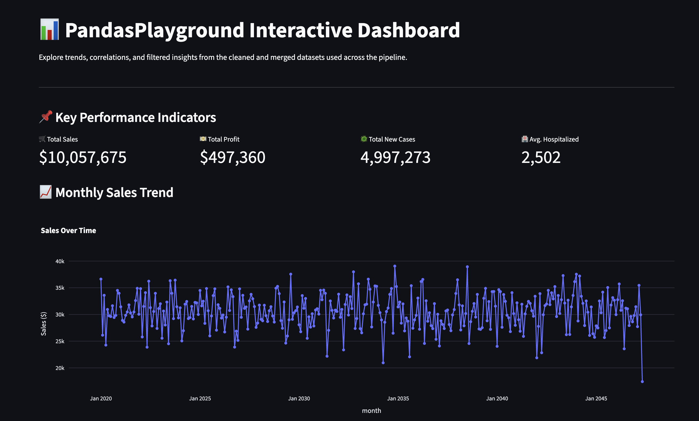

# PandasPlayground

[](https://github.com/SatvikPraveen/PandasPlayground/actions/workflows/ci.yml)


[](https://www.gnu.org/licenses/gpl-3.0)
[](https://github.com/astral-sh/ruff)


**A reproducible, tested toolkit and curriculum for rigorous data manipulation with pandas.**

PandasPlayground has two layers:

- **A curriculum** of 11 Jupyter notebooks that runs from loading and cleaning data to performance tuning and statistical inference.
- **A typed Python package**, `pandasplayground`, that the notebooks, a CLI and a Streamlit dashboard share. It provides
  schema validation, a deterministic pipeline with provenance manifests, interval estimates and effect sizes, seeded data
  generation and a benchmark harness.

Every published output can be re-derived from raw data, and CI fails if anything drifts.



## Contents

- [What makes it reproducible](#what-makes-it-reproducible)
- [Quick start](#quick-start)
- [Command-line interface](#command-line-interface)
- [Curriculum](#curriculum)
- [Package overview](#package-overview)
- [Findings](#findings)
- [Benchmarks](#benchmarks)
- [Data](#data)
- [Development](#development)
- [Citation](#citation)

## What makes it reproducible

| Guarantee | How it is enforced |
| --- | --- |
| Data matches its documented contract | Declarative schemas for every dataset. `pandasplayground validate` and CI check them. The [data dictionary](docs/DATA_DICTIONARY.md) is generated from the same schemas. |
| The final export is re-derivable | `pandasplayground pipeline` rebuilds it from raw files. CI requires a **byte-identical** result. |
| Every output is traceable | Each pipeline run writes a [manifest](exports/final_merged_pipeline.manifest.json) with input and output SHA-256 hashes, parameters, library versions and the git commit. |
| The raw data is re-derivable | The seeded generator reproduces every non-name column of the bundled data bit-for-bit. A test enforces this. |
| Notebooks run and stay stable | CI executes all 11 notebooks and fails if any CSV they write changes. |
| Results hold across environments | Tests run on Python 3.10 to 3.13, pandas 2.2 and 3.x, and Linux, macOS and Windows. |

See [docs/METHODOLOGY.md](docs/METHODOLOGY.md) for details and references.

## Quick start

```bash
git clone https://github.com/SatvikPraveen/PandasPlayground.git
cd PandasPlayground
./scripts/setup.sh              # creates .venv, installs everything, validates data, runs tests
source .venv/bin/activate

make run-jupyter                # open the notebooks
make run-streamlit              # dashboard on http://localhost:8501
make reproduce                  # rebuild every output and check that nothing changed
```

To install manually:

```bash
python -m venv .venv && source .venv/bin/activate
pip install -r requirements.txt          # package (editable) + notebooks + dashboard
pip install -r requirements_dev.txt      # + tests, linters, type checker
```

To use Docker:

```bash
docker build -t pandasplayground .
docker run --rm -p 8888:8888 pandasplayground                       # JupyterLab
docker run --rm pandasplayground pandasplayground validate           # CLI
docker run --rm -p 8501:8501 pandasplayground \
  streamlit run STREAMLIT_App.py --server.address=0.0.0.0            # dashboard
```

JupyterLab in the container prints a login token on startup.

## Command-line interface

```text
pandasplayground validate      Validate every bundled dataset against its schema
pandasplayground pipeline      Rebuild exports/final_merged_pipeline.csv from raw data, with a manifest
pandasplayground generate      Regenerate the synthetic datasets from a seed (never overwrites data/ without --force)
pandasplayground benchmark     Run the benchmark suite and write JSON and Markdown results
pandasplayground docs data-dictionary [--check]
pandasplayground info          Print environment and version information
```

## Curriculum

| Notebook | Topics |
| --- | --- |
| `01_data_loading` | CSV, Excel, multi-sheet Excel, JSON and Parquet. Inspecting structure and parsing dates. |
| `02_data_cleaning` | Missing values, type conversion, string normalisation, outliers. |
| `03_aggregation_grouping` | `groupby`, named aggregation, pivot and melt, window functions. |
| `04_merging_joining` | `merge`, `concat`, index joins, key diagnostics. |
| `05_time_series` | Resampling, rolling windows, time zones. |
| `06_advanced_pandas` | `apply`, `map`, method chaining, memory tuning. |
| `07_visualization_with_pandas` | Bar, line, box and grouped plots. |
| `08_final_pipeline` | End-to-end workflow, scripted as `pandasplayground pipeline`. |
| `09_reporting_exporting` | Excel, CSV and Parquet exports, styled reports. |
| `10_performance_diagnostics` | Profiling, `eval`, categoricals, Dask. |
| `11_statistical_inference_reproducibility` | Validation, provenance, bootstrap intervals, confounding in aggregated data, effect sizes, multiple comparisons. |

Notebooks 01 to 10 import helpers through `scripts/`, a compatibility layer over the package. Notebook 11 uses the package directly.
A quick reference is in [cheatsheets/pandas_cheatsheet.md](cheatsheets/pandas_cheatsheet.md).

## Package overview

```text
src/pandasplayground/
├── io.py            format-aware read/write, SHA-256 hashes, DataFrame fingerprints
├── cleaning.py      non-mutating normalisation, snake_case names, IQR, z-score and MAD outliers
├── aggregation.py   grouped, pivoted and period summaries, rolling rank
├── merging.py       safe_merge with cardinality validation and a MergeReport
├── memory.py        exact-by-default dtype optimisation with a MemoryReport
├── validation.py    declarative DataFrame schemas
├── schemas.py       contracts for every bundled dataset
├── stats.py         bootstrap, Wilson and Fisher-z intervals, permutation and Welch tests, effect sizes, FDR
├── pipeline.py      deterministic raw-to-panel pipeline, days_observed
├── provenance.py    run manifests
├── benchmark.py     calibrated, repeated micro-benchmarks
├── datagen.py       seeded synthetic data generator
├── dashboard.py     data logic behind the Streamlit app
└── cli.py           the pandasplayground command
```

```python
from pandasplayground import io, schemas, stats
from pandasplayground.pipeline import run_pipeline

report = schemas.SUPERSTORE.validate(io.read("data/superstore_sales.csv"))
report.raise_for_errors()

result = run_pipeline(write=False)
print(stats.bootstrap_ci(result.frame.profit / result.frame.sales))
```

## Findings

Applying these methods to the project itself turned up defects that the previous version silently carried:

- **A confound in the headline panel.** Monthly sales and COVID case totals correlate (r ≈ 0.26, 95% CI 0.15 to 0.35)
  although the daily data is independent. Both totals scale with the number of days in the month. Per-day rates remove
  the effect, and differencing does not. See notebook 11 and the [data card](docs/DATA_CARD.md).
- **Double counting on re-runs.** Notebook 03 matched regional files with a glob that also picked up a combined output
  written by notebook 04. Every re-run then reported twice the real number of loans.
- **Platform-dependent exports.** pandas' default CSV float parser does not round-trip the last digit, and its rounding
  differed between macOS and Linux. Re-exported reports drifted on CI until reads switched to exact parsing.
- **Silent data corruption.** Cleaning helpers turned missing values into the string `"nan"`, and memory optimisation
  rounded floats when downcasting. Both are fixed and covered by property-based tests.

The full list is in the [changelog](CHANGELOG.md).

## Benchmarks

Measured with `pandasplayground benchmark` at 100,000 rows with 7 repeats. The `apply` case uses 20,000 rows.
Speed-up is the ratio of median times, followed by the range across samples.

| Idiom | Speed-up |
| --- | --- |
| Vectorised arithmetic instead of `DataFrame.apply(axis=1)` | 594x (346x to 727x) |
| Parquet instead of CSV for reading | 10.3x (5.7x to 12.9x) |
| PyArrow strings instead of object strings | 4.4x (3.1x to 5.3x) |
| `category` instead of object group keys | 2.6x (1.9x to 3.5x) |
| `Series.isin` instead of chained `==` / `\|` | 2.3x (1.9x to 2.7x) |

`optimize_dataframe` made the benchmark frame 93% smaller.

These timings come from one Apple Silicon laptop running pandas 3.0. They are relative comparisons, not absolute
guarantees. The full table, environment and raw samples are in [docs/benchmark_results.md](docs/benchmark_results.md)
and [benchmarks/results/latest.json](benchmarks/results/latest.json). Techniques are explained in the
[performance guide](docs/PERFORMANCE.md).

## Data

All datasets are **synthetic**. They are generated by `pandasplayground.datagen` with seed 42 and contain no real people.

| File | Format | Rows |
| --- | --- | --- |
| `data/superstore_sales.csv` | CSV | 10,000 orders |
| `data/bank_loans.xlsx` | Excel | 10,000 applications |
| `data/bank_loans_multisheet.xlsx` | Excel, 4 sheets | 4 × 10,000 |
| `data/covid_data.parquet` | Parquet | 10,000 days |
| `data/weather_data.json` | JSON | 10,000 days |

Every variable is drawn independently, so the data has a **known null**. That makes it good for learning pandas and for
checking whether an analysis method produces false positives. It is not suitable for substantive conclusions.
Read the [data card](docs/DATA_CARD.md) for the generating distributions and known artefacts, and the
[data dictionary](docs/DATA_DICTIONARY.md) for column contracts.

## Development

```bash
make check        # ruff lint + format check, mypy, fast tests
make test-all     # including slow statistical property tests
make coverage     # HTML coverage report
make notebooks    # execute every notebook
make help         # all targets
```

The test suite includes unit tests, Hypothesis property tests, golden-file regression tests against the committed export,
reference-value tests for statistical methods, headless dashboard tests and notebook execution. Coverage is enforced at 85%.
See [CONTRIBUTING.md](CONTRIBUTING.md).

## Project structure

```text
PandasPlayground/
├── src/pandasplayground/   the package
├── tests/                  pytest suite
├── notebooks/              11 notebooks
├── scripts/                compatibility layer for notebooks, setup and export scripts
├── pages/, STREAMLIT_App.py  Streamlit dashboard
├── data/                   raw synthetic datasets
├── assets/, exports/       notebook and pipeline outputs, provenance manifest
├── benchmarks/results/     raw benchmark samples
└── docs/                   methodology, data card, data dictionary, performance guide
```

## Citation

If you use PandasPlayground in teaching or research, please cite it. GitHub's "Cite this repository" button reads
[CITATION.cff](CITATION.cff).

```bibtex
@software{praveen_pandasplayground_2026,
  author  = {Praveen, Satvik},
  title   = {PandasPlayground: a reproducible, tested toolkit and curriculum for data manipulation with pandas},
  version = {2.0.0},
  year    = {2026},
  url     = {https://github.com/SatvikPraveen/PandasPlayground}
}
```

## Related projects

- [NumPyMasterPro](https://github.com/SatvikPraveen/NumPyMasterPro): NumPy through modular walkthroughs.

## License

GNU General Public License v3.0 or later. See [LICENSE](LICENSE).

## Author

[Satvik Praveen](https://github.com/SatvikPraveen) · satvikpraveen707@gmail.com
